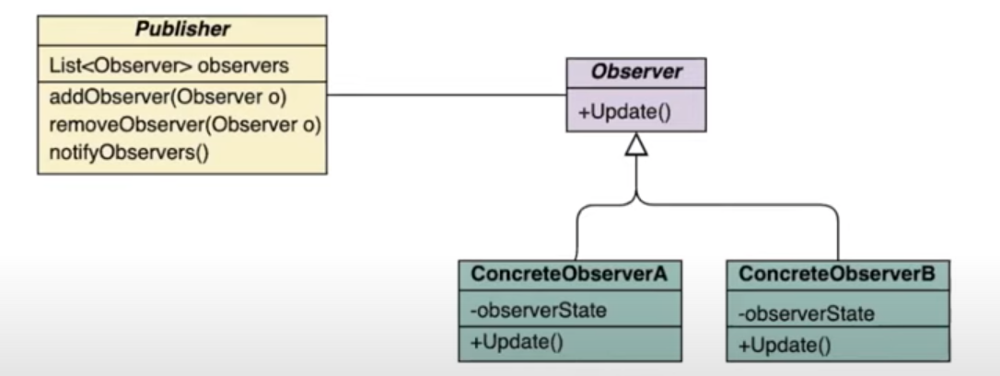

# Observer Pattern

Defines a one-to-many dependency between objects so that when one object changes state, all of its dependents are notified and updated automatically.

## Problem
One object's behaviour is closely tied to the state of another object, but we don't want to break encapsulation and poll the other objects' state frequently.

Reducing coupling will increase stability and reusability. 

## Pattern / Solution
- A listener interface is created with the xxxChanged method. This interface is implemeneted by all listeners.
- The listeners register themselves with the target at creation or during runtime.
- When a specific action occurs, the target notifies its listeners by calling the xxxChanged method.
- Occasionally, this event will be an object itself, if it has a meaning.
- Alternately, the notification will not pass any state,, but the listener will take action to obtain what it needs. 

## Trade Offs
- Can be more complex to trace through an event system.
- Gives support for broadcast communication.
- Don't pull out interfaces if they are not needed. One Observer does not warrant an Observer interface.
- Can lead to some repeated data - [e.g.] Attendant maintaining a list of available lots when ParkingLot has enough information to determine if parking could occur. 
- Potential for circular or cascading notifications in a heavily event-based system. This problem is aggravated by simple update notifications making it difficult to deduce what event actually took place.
- Ensure subject is in a consistent state before calling notification. 

## Pros and Cons
- Open/Closed Principle. We can introduce new subscriber classes without having to change the publisher's code (and vice versa if there's a publisher interface)
- We can establish relations between objects at runtime
- Subscribers are notified in random order.

## Example
- Even framework in Swing/other UIs. Lets us know if mourse/keyboard/etc. events occur. 

