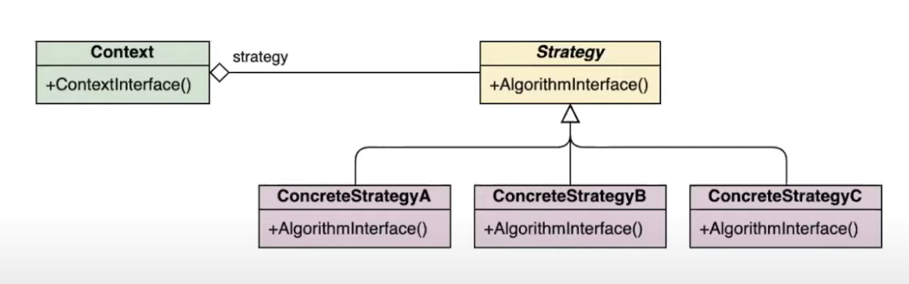
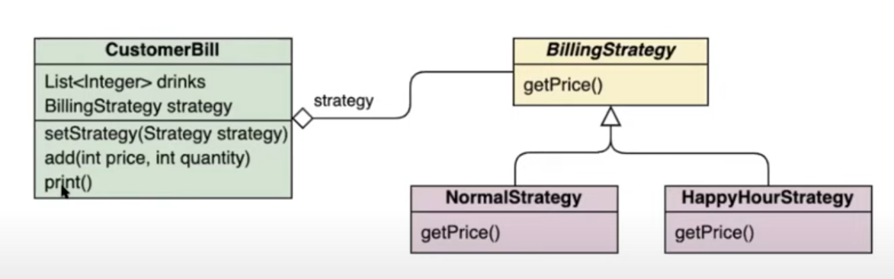

OOP Principles
1. Encapsulate what varies
2. Favor composition over inheritance
3. Program to interfaces, not implementations
4. Only to talk to your friends
   - Be conscious on how and what classes speak to each other

Relationships
1. Delegation
   - One-way relationship 
   - A knows about B, B doesn't know about A
   - Elements of Layer 1 can "cross" the line towards layer 2
   - Elements of Layer 2 can not "cross" the line towards layer 1
   - e.g. writing data to database, it doesn't need to know where it comes from 
2. Collaboration
   1. Two-way relationship
   2. e.g. A school class and a student, they know about each other  
3. Inheritance
   - 'Is a' relationship
   - Basing an object or class upon another object or class, retaining similar implementation 

# Mutability vs Immutability 
## Mutable objects
Mutable objects are objects that can be changed after they are created

When we made a change in existing mutable objects, no new object will be created; instead it will alter the value of the existing object.

The Getters and Setters are available in mutable objects.

Note: Mutating an object might not be thread-safe

## Immutable objects
Immutable objects are objects that cannot be changed and must be entirely set up in constructor.

Only Getters are available for immutable objects.

In general immutable objects are safer - they can be passed around and will never change. It is a good idea to make small, cheap objects immutable. 

To make objects immutable you declare the fields as final. 

# What is a design pattern?
Design patterns are a solution to commonly occurring problems. Provides a common language when talking about a solution. We will be describing the design patterns following this structure:
- Title
- Problem
- Pattern/Solution
- Trade Offs
- Example

Types of patterns:
1. Creational patterns
   - Involve object instantiation and provide a way to decouple a client from the objects it needs to instantiate
2. Behavioural patterns
   - Concerned with how the classes and objects interact and distribute responsibility 
3. Structural patterns
   - Let you compose classes or objects into larger structures

## Strategy pattern
Defines a family of algorithms, encapsulates each one, and makes them interchangeable.

It enables **selecting an algorithm at runtime**. Instead of implementing a single algorithm directly, code receives run-time instructions as to which in a family of algorithms to use.

### Problem
An object needs to have different ways of doing the same task. You want to be able to choose between different algorithms/behaviours for an object. Numerous of if/else statement determining behaviour.

### Pattern / Solution
- Decouple the behaviours from the object and isolate them into their own classes that share an interface
- Make the original object delegate to these classes 
- Tell the object which strategy to use when creating it or elsewhere (can be runtime)
- They are implemented as anonymous inner classes
- They don't hold state
- They take the original object as a parameter
- They are declared as constants in the original object

### Trade Offs
- Enables one algorithm to be swapped for another at runtime
- Complex design - intention of code is not as clear
- Often static/constant implementation. This forces you to pass in containing object to work on, polluting your interface slightly. 

### Example
- For instance, a class that performs validation on incoming data mau use the strategy pattern to select a validation algorithm depending on the type of data, the source of data, user choice, or other discriminating factors. These factors are not known until runtime and may require radically different validation to be performed. 



```typescript
class StrategyPattern {
   public static main():void {
      // Prepare strategies
      const normalStrategy: BillingStrategy = new NormalStrategy();
      const happyHourStrategy: BillingStrategy = new HappyHourStrategy();
   }
}

interface BillingStrategy {
   getPrice(price: number): number;
}

class HappyHourStrategy implements BillingStrategy  {
   public getPrice(price: number): number{
      return price/2;
   }
}

class NormalStrategy implements BillingStrategy {
   public getPrice(price: number): number {
      return price;
   }
}
```


## Singleton Pattern
Ensures a class has only one instance, and provides a global point of access to it.

### Problem
We need to ensure that a class has only one instance, or that it is thread safe

### Pattern/Solution
- Letting a class manage a single instance of itself
- Prevent other classes from creating a new instance of that class

### Trade Offs
- The Singleton pattern can mask bad design, for instance, when the components of the program know too much about each other.
- The pattern requires special treatment in a multi-threaded environment so that multiple threads won't create a singleton object several times.
- Reference: https://refactoring.guru/design-patterns/singleton

### Example 
- When shopping online, we want to create only one shopping basket.

```typescript
class SingletonShoppingCart{
    private static SingletonShoppingCart;
}
```
